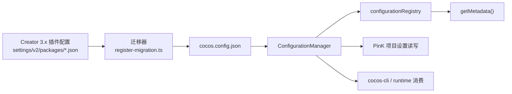

# Creator 3.x 配置迁移设计

更新时间：2026-07-03

本文说明 Creator 3.x 项目配置在 cocos-cli / PinK 中的迁移边界。它也作为 AI 编码上下文，避免后续把旧 Creator 配置误判为当前配置真相源。

## 结论

- cocos-cli / PinK 的项目配置真相源是项目根目录的 `cocos.config.json`。
- Creator 3.x 的 `settings/v2/packages/*.json`、`profiles/v2/packages/*.json` 属于旧插件配置系统，只作为迁移输入。
- PinK 打开项目或独立 cocos-cli MCP server 启动时，会初始化配置系统，并在需要时把旧 Creator 配置迁移到 `cocos.config.json`。
- 迁移完成后，项目配置以 `cocos.config.json` 为准。Creator 3.x 不再作为新配置的查看和编辑入口。
- Creator 3.x 仍可能打开项目，但它读取旧 `settings/v2/packages/*.json` 时看到旧值是设计边界，不代表 PinK / cocos-cli 写配置失败。
- 不做反写、双写或旧 Creator 3.x 反向兼容。新系统兼容老项目靠迁移，老 Creator 不需要理解新配置。

## 架构



核心职责：

- `CocosConfigLoader` 只负责读取 Creator 3.x 旧插件配置。
- `register-migration.ts` 只负责把旧结构映射到新结构。
- `ConfigurationManager` 负责加载、保存、版本判断和持久化 `cocos.config.json`。
- `configurationRegistry` 负责收集各模块注册的默认值和 metadata。
- PinK 项目设置界面通过 `getMetadata()` 渲染，通过配置系统 key 读写。
- 运行时逻辑应消费配置系统中的 key，而不是回读 Creator 旧插件配置。

## 迁移规则

迁移是旧项目进入新配置系统的入口，不是长期兼容层。

- 初次打开老项目时，如果 `cocos.config.json` 不存在或版本低于当前配置版本，可以执行迁移。
- 迁移结果写入 `cocos.config.json`，并带上配置版本。
- 后续版本已经满足要求时，不再自动从旧 Creator 配置重新导入，避免旧值覆盖新系统中的用户修改。
- 用户明确执行重新迁移时，应理解为一次覆盖性导入操作，而不是 Creator 3.x 兼容机制。

常见映射：

| Creator 3.x 来源 | cocos.config.json 目标 |
| --- | --- |
| `settings/v2/packages/project.json` 的 `general.designResolution` | `engine.designResolution` |
| `settings/v2/packages/project.json` 的 `script` | `script` |
| `settings/v2/packages/project.json` 的 `physics` | `engine.physicsConfig` |
| `settings/v2/packages/engine.json` 的 `macroConfig` | `engine.macroConfig` |
| `settings/v2/packages/engine.json` 的 `modules.configs` | `engine.configs` |
| `settings/v2/packages/builder.json` 的构建配置 | `builder` |

示例：PinK 中设置设计分辨率为 `1280 x 720`，正确落点是：

```json
{
    "engine": {
        "designResolution": {
            "width": 1280,
            "height": 720
        }
    }
}
```

不应要求 Creator 3.x 的 `settings/v2/packages/project.json` 也出现同样的新值。

## 编码准则

处理项目配置相关代码时，遵守以下规则：

1. 不要把 `settings/v2/packages/*.json` 当作 cocos-cli / PinK 当前配置源。
2. 不要新增把 `cocos.config.json` 反写到 Creator 3.x 旧插件配置的逻辑。
3. 不要用“Creator 3.x 项目设置界面没看到新值”判断 PinK 配置写入失败。
4. 新增配置时，在所属业务模块注册默认值和 metadata，不要维护中心化静态快照。
5. metadata 中的 property key 必须能通过配置系统直接读写。
6. 配置 UI、CLI API、运行时消费点都应读写配置系统 key。
7. 修复配置不生效问题时，优先检查：
   - metadata key 是否正确；
   - UI 是否通过配置系统写入；
   - `cocos.config.json` 是否保存成功；
   - 运行时是否读取了新配置 key；
   - 迁移映射是否覆盖旧配置来源。

## 非目标

- 不保证 Creator 3.x 项目设置界面能显示 PinK / cocos-cli 修改后的配置。
- 不保证迁移后的项目配置还能由 Creator 3.x 继续编辑。
- 不把 `settings/v2/packages/*.json` 作为 PinK 项目设置写入目标。
- 不通过反写 Creator 旧配置来修复新配置系统的消费链路问题。

## 相关文件

- `src/core/configuration/script/manager.ts`
- `src/core/configuration/migration/cocos-config-loader.ts`
- `src/core/configuration/migration/register-migration.ts`
- `src/api/configuration/configuration.ts`
- `src/lib/configuration/configuration.ts`
- `docs/dev/config-metadata-plan.md`
- `src/core/configuration/README.md`
- `src/core/configuration/migration/README.md`
